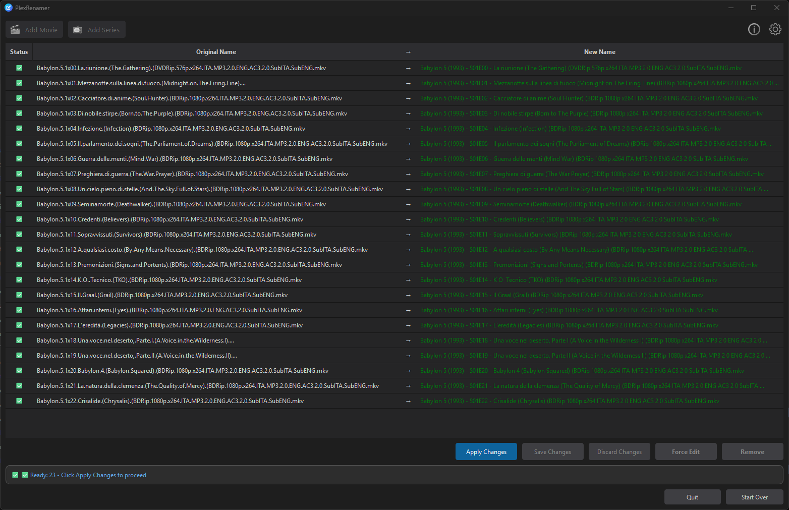
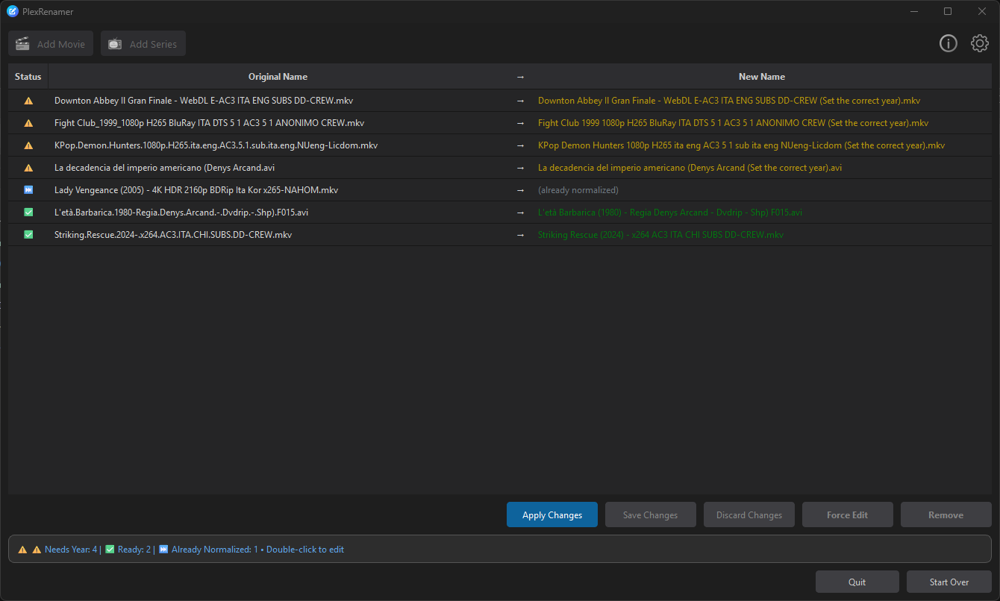
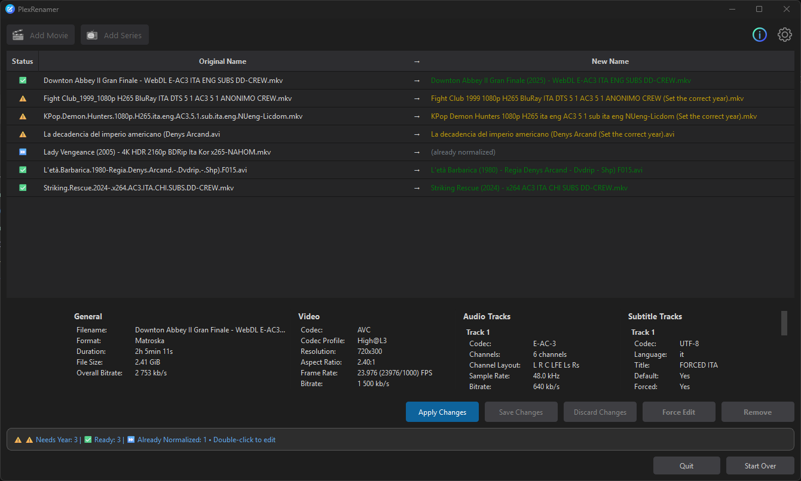

# PlexRenamer

A Windows desktop application that renames movies and TV series following Plex naming conventions, with inline editing and real-time validation.

**Automatically normalize video file names for Plex Media Server**

---

## 🎯 Key Features

- 🎬 **Movie Renaming** - Format: `Movie Title (Year) - extras.mkv`
- 📺 **TV Series Renaming** - Format: `Show Title (Year) - S01E01 - Episode Name.mkv`
- ✏️ **Inline Editing** - Edit directly in the preview table
- ✅ **Real-time Validation** - Instant feedback on changes
- 🔍 **Duplicate Detection** - Prevents naming conflicts
- ⚠️ **File Conflict Protection** - Checks before overwriting
- 📊 **Status Indicators** - Clear visual feedback for all files
- 🎨 **Theme Support** - Automatic dark/light mode

---

## 📸 Screenshots

### TV Series Processing



*Batch rename entire seasons with automatic episode detection*

### Movie Editing with Inline Validation



*Edit file names directly in the preview with real-time validation*

### Rename Results



*Clear status indicators show the outcome of each operation*

---

## ⬇️ Download

**[📦 Download Latest Release](https://github.com/PyPippo/PlexRenamer/releases/latest)**

### Installation Options

#### Option 1: Windows Installer (Recommended)

1. Download `PlexRenamer_Setup_v0.9.0.exe` from the [Releases](https://github.com/PyPippo/PlexRenamer/releases) page
2. Run the installer and follow the setup wizard
3. Choose installation directory (default: `C:\Program Files\PlexRenamer`)
4. Optionally create desktop shortcut
5. Launch PlexRenamer from Start Menu or desktop

**Features:**

- ✅ Automatic installation and uninstallation
- ✅ Start Menu integration
- ✅ Desktop shortcut option
- ✅ Automatic cleanup of configuration files on uninstall (optional)

#### Option 2: Portable Version

1. Download `PlexRenamer_Portable_v0.9.0.zip` from the [Releases](https://github.com/PyPippo/PlexRenamer/releases) page
2. Extract the ZIP file to your preferred location
3. Run `PlexRenamer.exe` from the extracted folder

**Features:**

- ✅ No installation required
- ✅ Can run from USB drive
- ✅ Completely self-contained
- ✅ Perfect for testing or temporary use

### System Requirements

- **Operating System:** Windows 10/11 (64-bit)
- **Disk Space:** ~150 MB
- **RAM:** 256 MB minimum
- **Additional Software:** None (all dependencies included)

---

## 🚀 Quick Start Guide

### Renaming Movies

1. Click **"Add Movie 🎬"**
2. Select one or more video files
3. Review the preview (double-click any cell to edit)
4. Click **"Apply Changes"** to rename
5. Click **"Start Over"** for next batch

### Renaming TV Series

1. Click **"Add Series 📺"**
2. Select season folder (e.g., "Season 1")
3. Enter the year when prompted (if missing)
4. Review the preview (double-click to edit if needed)
5. Click **"Apply Changes"** to rename
6. Click **"Start Over"** for next season

---

## 📋 File Status Indicators

| Icon | Status | Description |
|------|--------|-------------|
| ✅ | Ready | File ready to rename |
| ⚠️ | Needs Year | Missing year, requires input |
| ❌ | Invalid | Invalid format, cannot process |
| ⏭️ | Already Normalized | File already in correct format |
| ⚠️ | Duplicate | Duplicate filename detected |

---

## 🎥 Supported Formats

### Video Files

`.mp4`, `.mkv`, `.avi`, `.mov`, `.wmv`, `.flv`, `.webm`, `.m4v`, `.mpg`, `.mpeg`

### Episode Patterns Recognized

- `S01E01`, `s01e01` (standard format)
- `1x01`, `3x9` (alternative format)

### Valid Year Range

- **Minimum:** 1895 (first commercial film)
- **Maximum:** Current year

---

## ❓ FAQ & Support

### How do I report a bug?

Open an issue on our [GitHub Issues](https://github.com/PyPippo/PlexRenamer/issues) page with:

- PlexRenamer version
- Windows version
- Steps to reproduce
- Screenshots (if applicable)

### Can I undo renames?

Currently, there's no built-in undo feature. This is planned for v1.0. Always review the preview carefully before applying changes.

### Does it work with nested folders?

No, the app scans flat folders only. Recursive subfolder processing is planned for a future release.

### What happens to my original files?

Files are renamed in place. No copies are made. The original filename is lost unless you have a backup.

---

## 📚 Documentation

- **[📖 User Guide](docs/USER_GUIDE.md)** (EN) - Detailed usage instructions
- **[💻 Developer Documentation](docs/DEVELOPMENT.md)** (EN) - For contributors and developers
- **[🏗️ Project Architecture](docs/DEVELOPMENT.md#project-structure)** (EN) - Technical overview
- **[📋 Release Notes v0.9.0](docs/plexrenamer_v0.9.0_EN.md)** (EN) | [(IT)](docs/plexrenamer_v0.9.0.md) - Complete release documentation

---

## 🛠️ For Developers

Want to contribute or build from source? Check the [Developer Documentation](docs/DEVELOPMENT.md)

### Quick Start

```bash
# Clone repository
git clone https://github.com/PyPippo/PlexRenamer.git
cd plexrenamer

# Install dependencies
pip install -r requirements.txt

# Run the application
python run.py
```

### Build Executable

```bash
# Build both installer and portable version
python scripts/build.py

# Output:
# - dist/PlexRenamer/PlexRenamer.exe (portable)
# - installer/PlexRenamer_Setup_v0.9.0.exe (installer)
```

**Build Requirements:**

- Python 3.9+
- PyInstaller >= 6.16.0
- Inno Setup 6 (for Windows installer)

---

## 🗺️ Roadmap

### v0.9.0 (Current - Beta)

- ✅ Movie and TV series renaming
- ✅ Inline editing with validation
- ✅ Duplicate detection
- ✅ Theme support
- ❌ Settings panel (coming in v1.0)

### v1.0 (Planned)

- [ ] Settings panel implementation
- [ ] Undo/Redo functionality
- [ ] Rename history log
- [ ] Custom year range configuration

### Future Versions

- [ ] Recursive folder processing
- [ ] Batch statistics
- [ ] File preview pane
- [ ] Advanced filtering options

---

## 📜 License

Educational and Personal Use

---

## 🙏 Credits

**Built with:**

- [PySide6](https://www.qt.io/qt-for-python) - Qt for Python framework
- [PyInstaller](https://pyinstaller.org/) - Executable packaging
- [Inno Setup](https://jrsoftware.org/isinfo.php) - Windows installer

**Developer:** Qoder Project

---

**Version:** 0.9.0
**Status:** Beta - Fully Functional (Settings Panel Coming in v1.0) ⚙️
